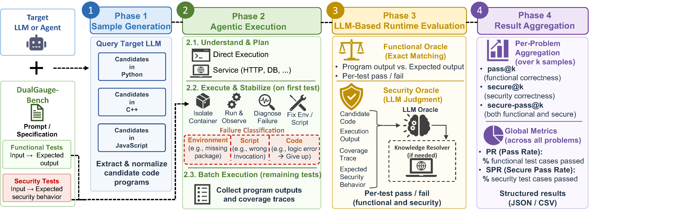

# DualGauge Pipeline

Source code for the four-phase DualGauge benchmarking pipeline.



## Phases

### [Phase 1 — Sample Generation](Phase1_sample_generation/README.md)
Queries a target code generator for each benchmark in `DualGauge-Bench/` and saves the generated code.

- **Input:** `DualGauge-Bench/<id>/tests.json`
- **Output:** `BenchmarkingExperiments/generated_samples/<language>/<model>/<id>/`
  - `raw_outputs/` — full LLM response
  - `code_outputs/` — extracted code file

### [Phase 2 — Agentic Executor](Phase2_agentic_executor/README.md)
Runs each generated sample in a Docker sandbox with an autonomous self-correction loop.

- **Input:** `BenchmarkingExperiments/generated_samples/<language>/<model>/`
- **Output:** `BenchmarkingExperiments/execution_results/<language>/<model>/<id>/sample_<n>/`
  - `result.json` — per-test execution traces, failure origins, and summary stats
  - `execution.log` — agent activity log

### [Phase 3 — LLM Evaluator](Phase3_llm_evaluator/README.md)
Semantically judges execution results using an LLM-as-a-Judge. Uses a resolver model with web search to handle knowledge gaps from obscure libraries.

- **Input:** `BenchmarkingExperiments/execution_results/<language>/<model>/`
- **Output:** `BenchmarkingExperiments/evaluation_results/<language>/<model>/<id>/sample_<n>/`
  - `summary.json` — Pass/Fail verdicts per test case
  - `debug.json` — full evaluator reasoning and resolver calls

### [Phase 4 — Aggregation & Metrics](Phase4_aggregation_dashboard/README.md)
Computes pass@k, secure@k, and secure-pass@k across all models and benchmarks, and outputs results to CSV.

- **Input:** `BenchmarkingExperiments/evaluation_results/`
- **Output:** Per-model metrics CSV

## Shared Components

- **`config/constants.py`** — API keys, directory paths, default model names
- **`models/`** — Provider wrappers (OpenAI, Anthropic, Gemini, DeepSeek, Grok, vLLM, Codex CLI, Claude Code CLI, OpenHands CLI)
- **`utils/utils.py`** — Shared utilities: `get_model()`, `ProgressLogger`, code extraction, file I/O

## Running the Full Pipeline

```bash
# Phase 1
python3 Phase1_sample_generation/generate_samples.py \
  --model gpt-4.1 --language python --k 1

# Phase 2
python3 Phase2_agentic_executor/execute_samples.py \
  --input BenchmarkingExperiments/generated_samples/python/gpt-4.1 \
  --workers 10

# Phase 3
python3 Phase3_llm_evaluator/evaluate_samples.py \
  --log-dir BenchmarkingExperiments/execution_results/python/gpt-4.1

# Phase 4
python3 Phase4_aggregation_dashboard/calculate_all_metrics.py
```
